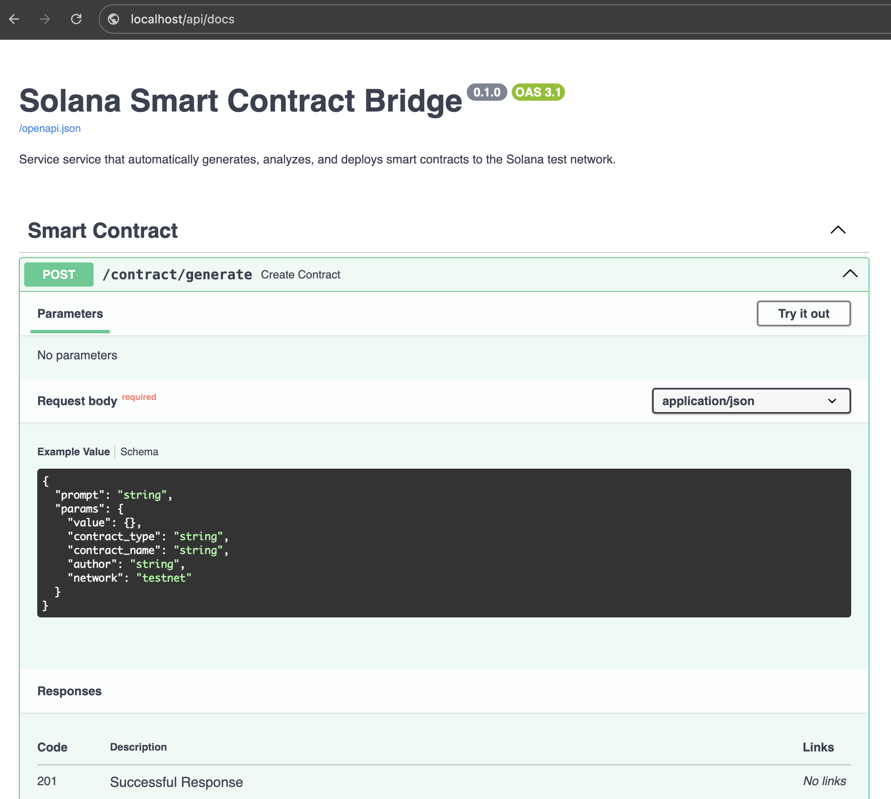

# Solana Smart Contract Bridge

## Description

This project is designed to automate the generation, analysis, and deployment of Solana smart contracts using OpenAI's API for code generation, static analysis tools (Clippy and Prusti) for validation, and Solana CLI for deployment. The system follows a structured approach, integrating FastAPI for request handling, dependency injection for modularity, and a domain-driven design (DDD) to maintain clear business logic.

## Architecture Diagram

[User]
|
|
▼

[FastAPI]---▶[Generation Service]---▶[OpenAI Adapter]
          │                       └─▶[StaticPromptTemplate]
          │
          ├─▶[Analysis Service]-----▶[Clippy Analyzer]
          │                       └─▶[Prusti Analyzer]
          │
          ├─▶[Deployment Service]---▶[Solana Deployer]
          │
          └─▶[Postgres Repository]--▶[PostgreSQL]

The system is composed of several key components that interact through a sequence of requests and responses. Below is a breakdown of the architecture:

### Core Components

1. ***API Layer (FastAPI)***

    - Exposes endpoints for contract generation, analysis, and deployment.

    - Uses dependency injection (Punq) for modularity.

    - Handles input validation and error management.

2. ***Generation Service***

    - Constructs structured prompts for OpenAI using predefined templates.

    - Requests code generation from OpenAI's GPT models.

    - Stores the generated code as a contract entity.

3. ***Analysis Service***

    - Runs static analysis tools like Clippy and Prusti.

    - Parses error messages and validation issues.

    - Provides auto-fixes for certain issues where applicable.

4. ***Deployment Service***

    - Uses Solana CLI and Anchor framework for smart contract deployment.

    - Updates program ID after successful deployment.

5. ***Infrastructure Layer***

    - OpenAIAdapter handles communication with OpenAI API.

    - StaticPromptTemplate generates structured prompts.
    
    - Postgres Repository: Saves contracts to PostgreSQL via SQLAlchemy.

### Request Flow

1️⃣ Contract Generation

    - User sends a request to /generate with contract parameters.

    - GenerationService creates a prompt and queries OpenAI for contract code.

    - Generated contract is returned to the user.

2️⃣ Static Analysis

    - User submits generated contract for analysis.

    - Clippy and Prusti analyzers validate the code.

    - Errors (if any) are returned with optional auto-fixes.

3️⃣ Deployment

    = Validated contract is sent to SolanaDeployer.

    - Anchor CLI builds and deploys the contract.

    - Program ID is updated, and deployment confirmation is sent.

## Technology Stack

    - FastAPI – API framework for handling HTTP requests.

    - OpenAI API – GPT-based code generation (gpt-4o-mini).

    - Rust (Anchor Framework) – Smart contract implementation.

    - Clippy & Prusti – Static analysis tools.

    - Solana CLI – Deployment and interaction with Solana blockchain.

    - Punq (Dependency Injection) – Manages service dependencies.

Future Enhancements

Adding AI-driven auto-corrections for errors detected by Clippy and Prusti.
Expanding contract templates for different use cases.
Introducing caching mechanisms to reduce OpenAI API calls(Redis).

## Installation & Setup

### Requirements

- Python 3.12
- Docker + Docker Compose

### Install Dependencies
```bash
poetry install
```

## Environment Configuration

Create a .env file and specify the required environment variables:
```env
OPENAI_API_KEY=your-api-key
```

## Running the Service with Docker Compose
```bash
docker compose -f docker_compose/app.yaml --env-file .env up --build -d
```

## Interactive API Documentation


## API Endpoints
1. Generate Smart Contract
POST /contracts/generate
```json
{
  "prompt": "",
  "params": {
    "value": {"Custom parameter": "custom parameter"},
    "contract_type": "NFT Minting Contract",
    "contract_name": "MyNFT",
    "author": "Joe",
    "network": "testnet"
  }
}

```
Response:
```json
{
  "id": "cef4d5f2-2d1c-4433-8eaf-a3bc4160f356",
  "status": "generated",
  "code": "use anchor_lang::prelude::*;\nuse anchor_lang::solana_program::pubkey::Pubkey;\nuse std::str::FromStr;\ndeclare_id!(\"bf586cbafd73c29266cb72fbba55b5ef\");\n#[program]\npub mod mynft {\n    use super::*;\n    pub fn initialize(ctx: Context<Initialize>, _name: String, _symbol: String) -> Result<()> {\n        let nft_account = &mut ctx.accounts.nft_account;\n        nft_account.name = _name;\n        nft_account.symbol = _symbol;\n        nft_account.mint_count = 0;\n        Ok(())\n    }\n    pub fn mint(ctx: Context<Mint>, _creator: Pubkey) -> Result<()> {\n        let nft_account = &mut ctx.accounts.nft_account;\n        require!(_creator == ctx.accounts.owner.key(), MyError::Unauthorized);\n        require!(nft_account.mint_count < 10000, MyError::MaxSupplyReached);\n        nft_account.mint_count += 1;\n        let new_token = Token::new(_creator, nft_account.mint_count); // Assuming Token struct exists\n        nft_account.tokens.push(new_token);\n        Ok(())\n    }\n    pub fn update_name(ctx: Context<UpdateName>, new_name: String) -> Result<()> {\n        let nft_account = &mut ctx.accounts.nft_account;\n        require!(new_name.len() <= 32, MyError::NameTooLong);\n        nft_account.name = new_name;\n        Ok(())\n    }\n}\n#[derive(Accounts)]\npub struct Initialize<'info> {\n    #[account(init, payer = signer, space = NftAccount::LEN)]\n    pub nft_account: Account<'info, NftAccount>,\n    #[account(mut)]\n    pub signer: Signer<'info>,\n    pub system_program: Program<'info, System>,\n}\n#[derive(Accounts)]\npub struct Mint<'info> {\n    #[account(mut)]\n    pub nft_account: Account<'info, NftAccount>,\n    #[account(mut)]\n    pub owner: Signer<'info>,\n}\n#[derive(Accounts)]\npub struct UpdateName<'info> {\n    #[account(mut)]\n    pub nft_account: Account<'info, NftAccount>,\n}\n#[account]\npub struct NftAccount {\n    pub name: String,\n    pub symbol: String,\n    pub mint_count: u32,\n    pub tokens: Vec<Token>, // Assuming Token struct is defined elsewhere\n}\nimpl NftAccount {\n    const LEN: usize = 8 + 4 + (32 * 3); // Adjust length as per fields\n}\n#[derive(Debug, Clone, Copy, AnchorSerialize, AnchorDeserialize)]\npub struct Token {\n    creator: Pubkey,\n    token_id: u32,\n}\n#[error]\npub enum MyError {\n    #[msg(\"You are not authorized to perform this action.\")]\n    Unauthorized,\n    #[msg(\"Maximum supply of NFTs has been reached.\")]\n    MaxSupplyReached,\n    #[msg(\"The name provided is too long.\")]\n    NameTooLong,\n}\n// Unit tests\n#[cfg(test)]\nmod tests {\n    use super::*;\n    use anchor_lang::prelude::*;\n    use anchor_lang::solana_program::clock::Clock;\n    use anchor_lang::{Key, ToAccountInfo};\n    #[test]\n    fn test_initialize() {\n        // Implement test logic for initializing NftAccount\n    }\n    #[test]\n    fn test_minting() {\n        // Implement test logic for minting NFT\n    }\n    #[test]\n    fn test_update_name() {\n        // Implement test logic for updating NFT name\n    }\n}",
  "errors": []
}
```

